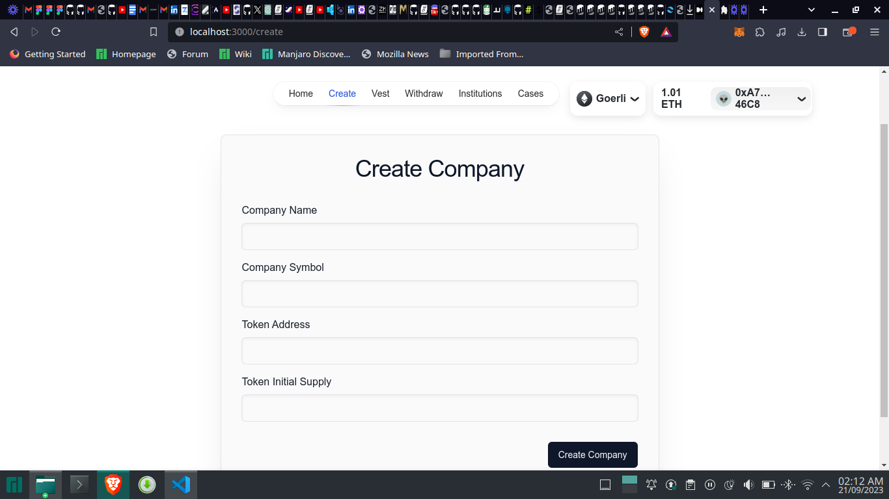
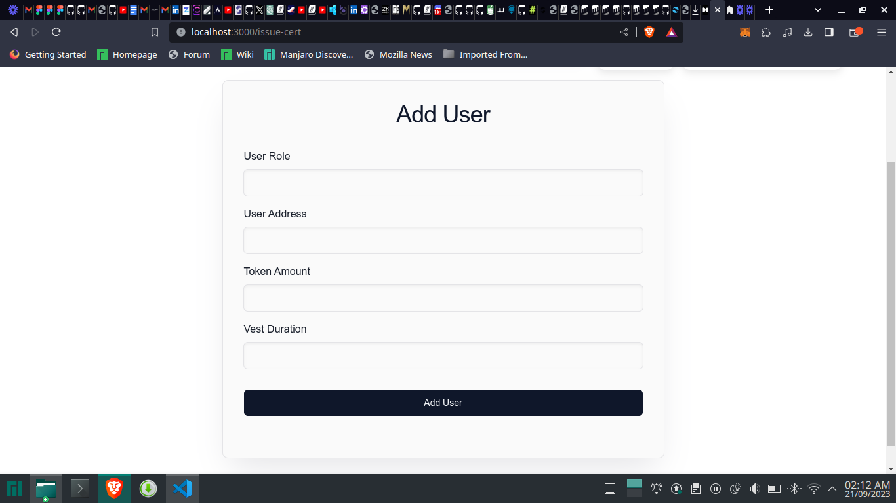
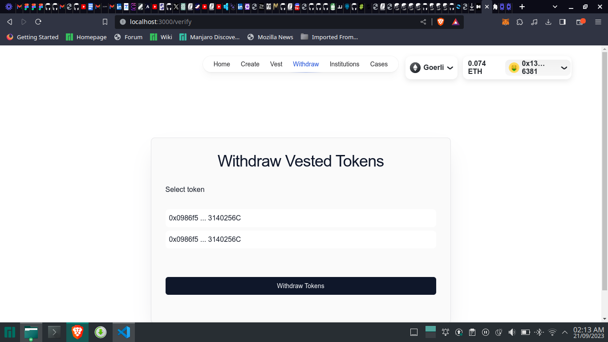

# VESTING CONTRACT DAPP

This Solidity program is a full stack "Vestinig contract" program that impliments the factory contract model to allow individuals create a vesting contracts it has a frontend fully integrated with smart contracts

## Description

This program is a simple contract written in Solidity, a programming language used for developing smart contracts on the Ethereum blockchain. The contract is a factory contract that deploys new instances of a child contract which individuas can use to create vesting plans onbehalf of staffs or stakeholders, of their company,the contract implements a time lock system which prevents users from withdrawing vested tokens before the aloted unlock time.

## LIVE LINK (FRONTEND):
https://vesting-token-front-end.vercel.app/

## CONTRACT ADDRESSES (GOERLI)
FACTORY CONTRACT: 0x577048d598E6b0657E9C0B0CC9901D2259baf5EC;
ORGANIZATION CONTRACT: 0x0986f511b8054Ee1c59f2b2823eCA50E3140256C;

### Executing program
#### STEP 1
- CREATE A VESTING COMAPNY.

#### STEP 2
- CREATE VESTING PLANS FOR USERS.

#### STEP 3
- USERS CAN WITHDRAW VESTED TOKENS AFTER THEIR TIMELOCK PERIOD.

## Authors

Idogwu Chinonso
[@metacraftersio](https://twitter.com/ChinonsoIdogwu)

## License

This project is licensed under the MIT License - see the LICENSE.md file for details